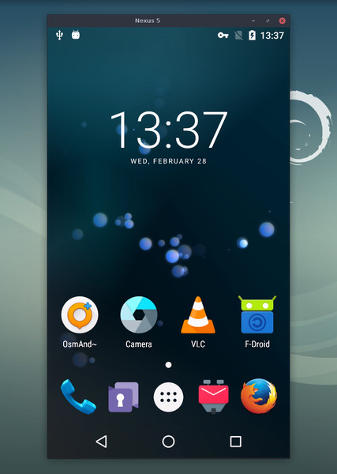

**This GitHub repo (<https://github.com/Genymobile/scrcpy>) is the only official
source for the project. Do not download releases from random websites, even if
their name contains `scrcpy`.**

# scrcpy (v2.3.1)


_pronounced "**scr**een **c**o**py**"_

This application mirrors Android devices (video and audio) connected via
USB or [over TCP/IP](doc/connection.md#tcpip-wireless), and allows to control the
device with the keyboard and the mouse of the computer. It does not require any
_root_ access. It works on _Linux_, _Windows_ and _macOS_.



It focuses on:

 - **lightness**: native, displays only the device screen
 - **performance**: 30~120fps, depending on the device
 - **quality**: 1920×1080 or above
 - **low latency**: [35~70ms][lowlatency]
 - **low startup time**: ~1 second to display the first image
 - **non-intrusiveness**: nothing is left installed on the Android device
 - **user benefits**: no account, no ads, no internet required
 - **freedom**: free and open source software

[lowlatency]: https://github.com/Genymobile/scrcpy/pull/646

Its features include:
 - [audio forwarding](doc/audio.md) (Android 11+)
 - [recording](doc/recording.md)
 - mirroring with [Android device screen off](doc/device.md#turn-screen-off)
 - [copy-paste](doc/control.md#copy-paste) in both directions
 - [configurable quality](doc/video.md)
 - [camera mirroring](doc/camera.md) (Android 12+)
 - [mirroring as a webcam (V4L2)](doc/v4l2.md) (Linux-only)
 - physical [keyboard][hid-keyboard] and [mouse][hid-mouse] simulation (HID)
 - [OTG mode](doc/otg.md)
 - and more…

[hid-keyboard]: doc/keyboard.md#physical-keyboard-simulation
[hid-mouse]: doc/mouse.md#physical-mouse-simulation

## Prerequisites

The Android device requires at least API 21 (Android 5.0).

[Audio forwarding](doc/audio.md) is supported for API >= 30 (Android 11+).

Make sure you [enabled USB debugging][enable-adb] on your device(s).

[enable-adb]: https://developer.android.com/studio/debug/dev-options#enable

On some devices, you also need to enable [an additional option][control] `USB
debugging (Security Settings)` (this is an item different from `USB debugging`)
to control it using a keyboard and mouse. Rebooting the device is necessary once
this option is set.

[control]: https://github.com/Genymobile/scrcpy/issues/70#issuecomment-373286323

Note that USB debugging is not required to run scrcpy in [OTG mode](doc/otg.md).


## Get the app

 - [Linux](doc/linux.md)
 - [Windows](doc/windows.md)
 - [macOS](doc/macos.md)


## Usage examples

There are a lot of options, [documented](#user-documentation) in separate pages.
Here are just some common examples.

 - Capture the screen in H.265 (better quality), limit the size to 1920, limit
   the frame rate to 60fps, disable audio, and control the device by simulating
   a physical keyboard:

    ```bash
    scrcpy --video-codec=h265 --max-size=1920 --max-fps=60 --no-audio --keyboard=uhid
    scrcpy --video-codec=h265 -m1920 --max-fps=60 --no-audio -K  # short version
    ```

 - Record the device camera in H.265 at 1920x1080 (and microphone) to an MP4
   file:

    ```bash
    scrcpy --video-source=camera --video-codec=h265 --camera-size=1920x1080 --record=file.mp4
    ```

 - Capture the device front camera and expose it as a webcam on the computer (on
   Linux):

    ```bash
    scrcpy --video-source=camera --camera-size=1920x1080 --camera-facing=front --v4l2-sink=/dev/video2 --no-playback
    ```

 - Control the device without mirroring by simulating a physical keyboard and
   mouse (USB debugging not required):

    ```bash
    scrcpy --otg
    ```

## User documentation

The application provides a lot of features and configuration options. They are
documented in the following pages:

 - [Connection](doc/connection.md)
 - [Video](doc/video.md)
 - [Audio](doc/audio.md)
 - [Control](doc/control.md)
 - [Keyboard](doc/keyboard.md)
 - [Mouse](doc/mouse.md)
 - [Device](doc/device.md)
 - [Window](doc/window.md)
 - [Recording](doc/recording.md)
 - [Tunnels](doc/tunnels.md)
 - [OTG](doc/otg.md)
 - [Camera](doc/camera.md)
 - [Video4Linux](doc/v4l2.md)
 - [Shortcuts](doc/shortcuts.md)


## Resources

 - [FAQ](FAQ.md)
 - [Translations][wiki] (not necessarily up to date)
 - [Build instructions](doc/build.md)
 - [Developers](doc/develop.md)

[wiki]: https://github.com/Genymobile/scrcpy/wiki


## Articles

- [Introducing scrcpy][article-intro]
- [Scrcpy now works wirelessly][article-tcpip]
- [Scrcpy 2.0, with audio][article-scrcpy2]

[article-intro]: https://blog.rom1v.com/2018/03/introducing-scrcpy/
[article-tcpip]: https://www.genymotion.com/blog/open-source-project-scrcpy-now-works-wirelessly/
[article-scrcpy2]: https://blog.rom1v.com/2023/03/scrcpy-2-0-with-audio/

## Contact

If you encounter a bug, please read the [FAQ](FAQ.md) first, then open an [issue].

[issue]: https://github.com/Genymobile/scrcpy/issues

For general questions or discussions, you can also use:

 - Reddit: [`r/scrcpy`](https://www.reddit.com/r/scrcpy)
 - Twitter: [`@scrcpy_app`](https://twitter.com/scrcpy_app)


## Donate

I'm [@rom1v](https://github.com/rom1v), the author and maintainer of _scrcpy_.

If you appreciate this application, you can [support my open source
work][donate]:
 - [GitHub Sponsors](https://github.com/sponsors/rom1v)
 - [Liberapay](https://liberapay.com/rom1v/)
 - [PayPal](https://paypal.me/rom2v)

[donate]: https://blog.rom1v.com/about/#support-my-open-source-work

## Licence

    Copyright (C) 2018 Genymobile
    Copyright (C) 2018-2024 Romain Vimont

    Licensed under the Apache License, Version 2.0 (the "License");
    you may not use this file except in compliance with the License.
    You may obtain a copy of the License at

        http://www.apache.org/licenses/LICENSE-2.0

    Unless required by applicable law or agreed to in writing, software
    distributed under the License is distributed on an "AS IS" BASIS,
    WITHOUT WARRANTIES OR CONDITIONS OF ANY KIND, either express or implied.
    See the License for the specific language governing permissions and
    limitations under the License.
