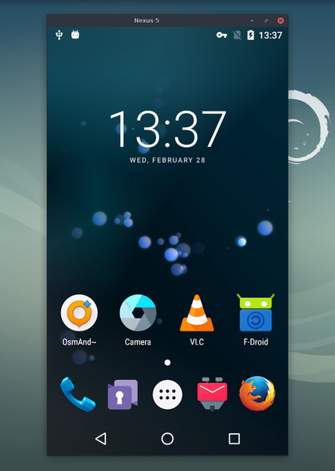

**This GitHub repo (<https://github.com/Genymobile/scrcpy>) is the only official
source for the project. Do not download releases from random websites, even if
their name contains `scrcpy`.**

# scrcpy (v3.3.4)


_pronounced "**scr**een **c**o**py**"_

This application mirrors Android devices (video and audio) connected via USB or
[TCP/IP](doc/connection.md#tcpip-wireless) and allows control using the
computer's keyboard and mouse. It does not require _root_ access or an app
installed on the device. It works on _Linux_, _Windows_, and _macOS_.



It focuses on:

 - **lightness**: native, displays only the device screen
 - **performance**: 30~120fps, depending on the device
 - **quality**: 1920×1080 or above
 - **low latency**: [35~70ms][lowlatency]
 - **low startup time**: ~1 second to display the first image
 - **non-intrusiveness**: nothing is left installed on the Android device
 - **user benefits**: no account, no ads, no internet required
 - **freedom**: free and open source software

[lowlatency]: https://github.com/Genymobile/scrcpy/pull/646

Its features include:
 - [audio forwarding](doc/audio.md) (Android 11+)
 - [recording](doc/recording.md)
 - [virtual display](doc/virtual_display.md)
 - mirroring with [Android device screen off](doc/device.md#turn-screen-off)
 - [copy-paste](doc/control.md#copy-paste) in both directions
 - [configurable quality](doc/video.md)
 - [camera mirroring](doc/camera.md) (Android 12+)
 - [mirroring as a webcam (V4L2)](doc/v4l2.md) (Linux-only)
 - physical [keyboard][hid-keyboard] and [mouse][hid-mouse] simulation (HID)
 - [gamepad](doc/gamepad.md) support
 - [OTG mode](doc/otg.md)
 - and more…

[hid-keyboard]: doc/keyboard.md#physical-keyboard-simulation
[hid-mouse]: doc/mouse.md#physical-mouse-simulation

## Prerequisites

The Android device requires at least API 21 (Android 5.0).

[Audio forwarding](doc/audio.md) is supported for API >= 30 (Android 11+).

Make sure you [enabled USB debugging][enable-adb] on your device(s).

[enable-adb]: https://developer.android.com/studio/debug/dev-options#enable

On some devices (especially Xiaomi), you might get the following error:

```
Injecting input events requires the caller (or the source of the instrumentation, if any) to have the INJECT_EVENTS permission.
```

In that case, you need to enable [an additional option][control] `USB debugging
(Security Settings)` (this is an item different from `USB debugging`) to control
it using a keyboard and mouse. Rebooting the device is necessary once this
option is set.

[control]: https://github.com/Genymobile/scrcpy/issues/70#issuecomment-373286323

Note that USB debugging is not required to run scrcpy in [OTG mode](doc/otg.md).


## Get the app

 - [Linux](doc/linux.md)
 - [Windows](doc/windows.md) (read [how to run](doc/windows.md#run))
 - [macOS](doc/macos.md)

## Fork features (this repo)

This fork adds a small toolbar above the mirrored device screen with four
buttons (left → right):

 1. **Dump full system logs** — runs `adb logcat -d -b all` and writes the
    output to `~/Downloads/scrcpy_syslogs_<timestamp>.txt`. Unfiltered, all
    buffers (main, system, crash, events, radio, …).
 2. **Dump foreground-app logs** — runs `adb logcat -d --pid=$(adb shell pidof
    <foreground-pkg>)` and writes to
    `~/Downloads/scrcpy_logs_<timestamp>.txt`. Falls back to the full buffer
    if the foreground package can't be detected.
 3. **Open live logcat** — opens a Terminal window streaming `adb logcat
    --pid=…` for the foreground app (same as `Ctrl+Shift+L`).
 4. **Screenshot** — saves a PNG to `~/Downloads/scrcpy_<timestamp>.png` **and
    copies it to the system clipboard** so you can paste it straight into
    Slack/Messages/etc. (same as `Ctrl+Shift+S`).

All dumps are point-in-time snapshots of the device's in-memory log ring
buffers; older entries that have already been overwritten are not recoverable
(Android doesn't persist logs to disk). Run `adb logcat -g` to see the exact
buffer sizes on your device.

### macOS: launch scrcpy from the Dock

A minimal `Scrcpy.app` bundle lets you launch the build from the Dock without
opening a terminal. To set it up after cloning and building (`meson setup
build && ninja -C build`):

```bash
# 1. Create the .app skeleton
mkdir -p "/Applications/Scrcpy.app/Contents/MacOS" \
         "/Applications/Scrcpy.app/Contents/Resources"

# 2. Info.plist
cat > "/Applications/Scrcpy.app/Contents/Info.plist" <<'PLIST'
<?xml version="1.0" encoding="UTF-8"?>
<!DOCTYPE plist PUBLIC "-//Apple//DTD PLIST 1.0//EN" "http://www.apple.com/DTDs/PropertyList-1.0.dtd">
<plist version="1.0">
<dict>
    <key>CFBundleExecutable</key><string>scrcpy-launcher</string>
    <key>CFBundleIdentifier</key><string>com.local.scrcpy</string>
    <key>CFBundleName</key><string>Scrcpy</string>
    <key>CFBundleDisplayName</key><string>Scrcpy</string>
    <key>CFBundleVersion</key><string>1.0</string>
    <key>CFBundleShortVersionString</key><string>1.0</string>
    <key>CFBundlePackageType</key><string>APPL</string>
    <key>CFBundleIconFile</key><string>icon</string>
</dict>
</plist>
PLIST

# 3. Launcher script — edit the cd path and PATH to match your setup.
#    PATH must include adb (Finder-launched apps don't inherit your shell PATH).
cat > "/Applications/Scrcpy.app/Contents/MacOS/scrcpy-launcher" <<'SH'
#!/usr/bin/env bash
export PATH="$HOME/Library/Android/sdk/platform-tools:/opt/homebrew/bin:/usr/local/bin:/usr/bin:/bin:$PATH"
cd "$HOME/scrcpy"          # ← adjust to where you cloned this repo
exec ./run build "$@"
SH
chmod +x "/Applications/Scrcpy.app/Contents/MacOS/scrcpy-launcher"

# 4. Icon (converts the repo icon to .icns)
cp app/data/icon.png "/Applications/Scrcpy.app/Contents/Resources/icon.png"
sips -s format icns "/Applications/Scrcpy.app/Contents/Resources/icon.png" \
     --out "/Applications/Scrcpy.app/Contents/Resources/icon.icns"

# 5. Refresh Finder's icon cache, then launch once
touch /Applications/Scrcpy.app
open /Applications/Scrcpy.app
```

Once it's running, right-click the Dock icon → **Options → Keep in Dock** to
pin it. From then on, clicking the Dock icon runs `./run build` from the repo
and opens the mirrored device window.

If the Dock icon "opens and immediately quits", it usually means `adb` isn't
on the `PATH` baked into the launcher — edit `scrcpy-launcher` and add the
directory where `which adb` points.


## Must-know tips

 - [Reducing resolution](doc/video.md#size) may greatly improve performance
   (`scrcpy -m1024`)
 - [_Right-click_](doc/mouse.md#mouse-bindings) triggers `BACK`
 - [_Middle-click_](doc/mouse.md#mouse-bindings) triggers `HOME`
 - <kbd>Alt</kbd>+<kbd>f</kbd> toggles [fullscreen](doc/window.md#fullscreen)
 - There are many other [shortcuts](doc/shortcuts.md)


## Usage examples

There are a lot of options, [documented](#user-documentation) in separate pages.
Here are just some common examples.

 - Capture the screen in H.265 (better quality), limit the size to 1920, limit
   the frame rate to 60fps, disable audio, and control the device by simulating
   a physical keyboard:

    ```bash
    scrcpy --video-codec=h265 --max-size=1920 --max-fps=60 --no-audio --keyboard=uhid
    scrcpy --video-codec=h265 -m1920 --max-fps=60 --no-audio -K  # short version
    ```

 - Start VLC in a new virtual display (separate from the device display):

    ```bash
    scrcpy --new-display=1920x1080 --start-app=org.videolan.vlc
    ```

 - Record the device camera in H.265 at 1920x1080 (and microphone) to an MP4
   file:

    ```bash
    scrcpy --video-source=camera --video-codec=h265 --camera-size=1920x1080 --record=file.mp4
    ```

 - Capture the device front camera and expose it as a webcam on the computer (on
   Linux):

    ```bash
    scrcpy --video-source=camera --camera-size=1920x1080 --camera-facing=front --v4l2-sink=/dev/video2 --no-playback
    ```

 - Control the device without mirroring by simulating a physical keyboard and
   mouse (USB debugging not required):

    ```bash
    scrcpy --otg
    ```

 - Control the device using gamepad controllers plugged into the computer:

    ```bash
    scrcpy --gamepad=uhid
    scrcpy -G  # short version
    ```

## User documentation

The application provides a lot of features and configuration options. They are
documented in the following pages:

 - [Connection](doc/connection.md)
 - [Video](doc/video.md)
 - [Audio](doc/audio.md)
 - [Control](doc/control.md)
 - [Keyboard](doc/keyboard.md)
 - [Mouse](doc/mouse.md)
 - [Gamepad](doc/gamepad.md)
 - [Device](doc/device.md)
 - [Window](doc/window.md)
 - [Recording](doc/recording.md)
 - [Virtual display](doc/virtual_display.md)
 - [Tunnels](doc/tunnels.md)
 - [OTG](doc/otg.md)
 - [Camera](doc/camera.md)
 - [Video4Linux](doc/v4l2.md)
 - [Shortcuts](doc/shortcuts.md)


## Resources

 - [FAQ](FAQ.md)
 - [Translations][wiki] (not necessarily up to date)
 - [Build instructions](doc/build.md)
 - [Developers](doc/develop.md)

[wiki]: https://github.com/Genymobile/scrcpy/wiki


## Articles

- [Introducing scrcpy][article-intro]
- [Scrcpy now works wirelessly][article-tcpip]
- [Scrcpy 2.0, with audio][article-scrcpy2]

[article-intro]: https://blog.rom1v.com/2018/03/introducing-scrcpy/
[article-tcpip]: https://www.genymotion.com/blog/open-source-project-scrcpy-now-works-wirelessly/
[article-scrcpy2]: https://blog.rom1v.com/2023/03/scrcpy-2-0-with-audio/

## Contact

You can open an [issue] for bug reports, feature requests or general questions.

For bug reports, please read the [FAQ](FAQ.md) first, you might find a solution
to your problem immediately.

[issue]: https://github.com/Genymobile/scrcpy/issues

You can also use:

 - Reddit: [`r/scrcpy`](https://www.reddit.com/r/scrcpy)
 - BlueSky: [`@scrcpy.bsky.social`](https://bsky.app/profile/scrcpy.bsky.social)
 - Twitter: [`@scrcpy_app`](https://twitter.com/scrcpy_app)


## Donate

I'm [@rom1v](https://github.com/rom1v), the author and maintainer of _scrcpy_.

If you appreciate this application, you can [support my open source
work][donate]:
 - [GitHub Sponsors](https://github.com/sponsors/rom1v)
 - [Liberapay](https://liberapay.com/rom1v/)
 - [PayPal](https://paypal.me/rom2v)

[donate]: https://blog.rom1v.com/about/#support-my-open-source-work

## License

    Copyright (C) 2018 Genymobile
    Copyright (C) 2018-2026 Romain Vimont

    Licensed under the Apache License, Version 2.0 (the "License");
    you may not use this file except in compliance with the License.
    You may obtain a copy of the License at

        http://www.apache.org/licenses/LICENSE-2.0

    Unless required by applicable law or agreed to in writing, software
    distributed under the License is distributed on an "AS IS" BASIS,
    WITHOUT WARRANTIES OR CONDITIONS OF ANY KIND, either express or implied.
    See the License for the specific language governing permissions and
    limitations under the License.
