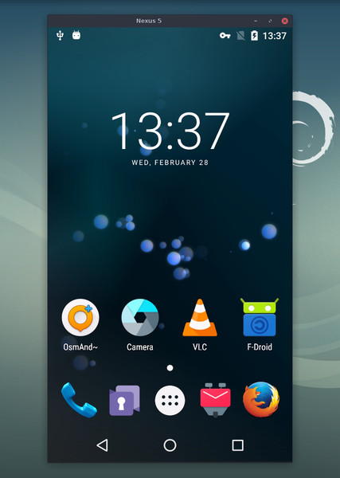

> [!WARNING]
> **This GitHub repo (<https://github.com/Genymobile/scrcpy>) is the only official
source for the project. Do not download releases from random websites, even if
their name contains `scrcpy`.**

# scrcpy-gui

A modern GUI for scrcpy with Material Design 3 styling.

## Features

- **Material Design 3** - Beautiful, modern interface
- **Multi-language Support** - English and Russian localization
- **Easy Device Connection** - USB and WiFi (TCP/IP) support
- **Full scrcpy Settings** - All video, audio, recording, and control options
- **Tabbed Interface** - Organized settings by category
- **Built-in Tutorials** - Step-by-step connection guides
- **Configuration Save/Load** - Save your preferred settings
- **Dark/Light Themes** - Choose your preferred appearance

## Requirements

- Python 3.8+
- PySide6
- scrcpy (installed separately)
- adb (Android Debug Bridge)

## Installation

### Windows

1. Install Python from https://python.org
2. Run `build.bat` to build the application
3. Run `dist\run.bat` to start the application

Or manually:
```bash
pip install PySide6
python scrcpy_gui.py
```

### Linux/macOS

```bash
chmod +x build.sh
./build.sh
./dist/run.sh
```

Or manually:
```bash
pip3 install PySide6
python3 scrcpy_gui.py
```

## Usage

### Connecting via USB

1. Enable Developer Options on your Android device
   - Go to Settings → About phone
   - Tap "Build number" 7 times
2. Enable USB debugging
   - Go to Settings → System → Developer options
   - Enable "USB debugging"
3. Connect your device via USB cable
4. Accept the USB debugging prompt on your device
5. Click "Refresh Devices" in scrcpy-gui
6. Select your device and click "Connect"
7. Click "Start Mirroring"

### Connecting via WiFi

1. First complete USB setup above
2. Connect device and computer to the same WiFi network
3. Get device IP address:
   - Settings → About phone → Status
   - Or run: `adb shell ip route | awk '{print $9}'`
4. Enable TCP/IP mode: `adb tcpip 5555`
5. Disconnect USB cable
6. Enter IP address in scrcpy-gui and click "Connect"
7. Click "Start Mirroring"

## Settings

### Video Tab
- Max Resolution (0 = unlimited)
- Bit Rate (Mbps)
- Max FPS
- Display ID
- Video Codec (h264, h265, av1)
- Crop Video

### Audio Tab
- Enable/Disable Audio
- Audio Bit Rate
- Audio Codec (opus, aac, flac, raw)
- Audio Source (output, playback, mic)

### Recording Tab
- Enable Recording
- Record Format (mp4, mkv)
- Record File Path
- No Video Playback (record only)
- No Audio Playback (record only)

### Control Tab
- Prefer Text Input
- Raw Key Events
- Gamepad Support
- Mouse Binding Mode

### Window Tab
- Window Title
- Always on Top
- Borderless Window
- Start Fullscreen
- Window Position (X, Y)
- Window Size (Width, Height)
- Background Color
- Disable Screensaver

### Advanced Tab
- Time Limit
- Turn Screen Off
- Power Off on Close
- Don't Power On
- Kill ADB on Close
- Force ADB Forward
- Tunnel Host/Port

## Keyboard Shortcuts (in scrcpy window)

- `Alt+F` - Toggle fullscreen
- `Right-click` - Back button
- `Middle-click` - Home button
- `Ctrl+C` - Copy
- `Ctrl+V` - Paste

For more shortcuts, see scrcpy documentation.

## Configuration

Settings are automatically saved to `~/.scrcpy-gui/config.json`

You can also manually save/load configurations from the Advanced tab.

## License

This GUI is provided as-is. Original scrcpy by Genymobile.

## Troubleshooting

### "No devices found"
- Make sure USB debugging is enabled
- Try a different USB cable
- Install proper USB drivers (Windows)
- Run `adb devices` to verify detection

### "Failed to connect"
- Check that device and computer are on same network
- Verify IP address is correct
- Make sure port 5555 is not blocked by firewall
- Try `adb kill-server` and reconnect

### "scrcpy not found"
- Install scrcpy from https://github.com/Genymobile/scrcpy
- Make sure scrcpy is in your system PATH

# scrcpy (v4.1)


_pronounced "**scr**een **c**o**py**"_

This application mirrors Android devices (video and audio) connected via USB or
[TCP/IP](doc/connection.md#tcpip-wireless) and allows control using the
computer's keyboard and mouse. It does not require _root_ access or an app
installed on the device. It works on _Linux_, _Windows_, and _macOS_.

[](doc/linux.md)&nbsp;
[](doc/windows.md)&nbsp;
[](doc/macos.md)&nbsp;



It focuses on:

 - **lightness**: native, displays only the device screen
 - **performance**: 30~120fps, depending on the device
 - **quality**: 1920×1080 or above
 - **low latency**: [35~70ms][lowlatency]
 - **low startup time**: ~1 second to display the first image
 - **non-intrusiveness**: nothing is left installed on the Android device
 - **user benefits**: no account, no ads, no internet required
 - **freedom**: free and open source software

[lowlatency]: https://github.com/Genymobile/scrcpy/pull/646

Its features include:
 - [audio forwarding](doc/audio.md) (Android 11+)
 - [recording](doc/recording.md)
 - [virtual display](doc/virtual-display.md)
 - mirroring with [Android device screen off](doc/device.md#turn-screen-off)
 - [copy-paste](doc/control.md#copy-paste) in both directions
 - [configurable quality](doc/video.md)
 - [camera mirroring](doc/camera.md) (Android 12+)
 - [mirroring as a webcam (V4L2)](doc/v4l2.md) (Linux-only)
 - physical [keyboard][hid-keyboard] and [mouse][hid-mouse] simulation (HID)
 - [gamepad](doc/gamepad.md) support
 - [OTG mode](doc/otg.md)
 - and more…

[hid-keyboard]: doc/keyboard.md#physical-keyboard-simulation
[hid-mouse]: doc/mouse.md#physical-mouse-simulation

## Prerequisites

The Android device requires at least API 21 (Android 5.0).

[Audio forwarding](doc/audio.md) is supported for API >= 30 (Android 11+).

Make sure you [enabled USB debugging][enable-adb] on your device(s).

[enable-adb]: https://developer.android.com/studio/debug/dev-options#enable

On some devices (especially Xiaomi), you might get the following error:

```
Injecting input events requires the caller (or the source of the instrumentation, if any) to have the INJECT_EVENTS permission.
```

In that case, you need to enable [an additional option][control] `USB debugging
(Security Settings)` (this is an item different from `USB debugging`) to control
it using a keyboard and mouse. Rebooting the device is necessary once this
option is set.

[control]: https://github.com/Genymobile/scrcpy/issues/70#issuecomment-373286323

Note that USB debugging is not required to run scrcpy in [OTG mode](doc/otg.md).


## Get the app

 - [Linux](doc/linux.md)
 - [Windows](doc/windows.md) (read [how to run](doc/windows.md#run))
 - [macOS](doc/macos.md)


## Must-know tips

 - [Reducing resolution](doc/video.md#size) may greatly improve performance
   (`scrcpy -m1024`)
 - [_Right-click_](doc/mouse.md#mouse-bindings) triggers `BACK`
 - [_Middle-click_](doc/mouse.md#mouse-bindings) triggers `HOME`
 - <kbd>Alt</kbd>+<kbd>f</kbd> toggles [fullscreen](doc/window.md#fullscreen)
 - There are many other [shortcuts](doc/shortcuts.md)


## Usage examples

There are a lot of options, [documented](#user-documentation) in separate pages.
Here are just some common examples.

 - Capture the screen in H.265 (better quality), limit the size to 1920, limit
   the frame rate to 60fps, disable audio, and control the device by simulating
   a physical keyboard:

    ```bash
    scrcpy --video-codec=h265 --max-size=1920 --max-fps=60 --no-audio --keyboard=uhid
    scrcpy --video-codec=h265 -m1920 --max-fps=60 --no-audio -K  # short version
    ```

 - Start VLC in a new virtual display (separate from the device display):

    ```bash
    scrcpy --new-display=1920x1080 --start-app=org.videolan.vlc
    ```

 - Start VLC in a new _flex_ display using H.265 with a bitrate of 16 Mbps,
   while keeping the display active so it does not turn off:

    ```bash
    scrcpy --new-display -x --keep-active --start-app=org.videolan.vlc --video-codec=h265 -b16M
    ```

 - Record the device camera in H.265 at 1920x1080 (and microphone) to an MP4
   file:

    ```bash
    scrcpy --video-source=camera --video-codec=h265 --camera-size=1920x1080 --record=file.mp4
    ```

 - Capture the device front camera and expose it as a webcam on the computer (on
   Linux):

    ```bash
    scrcpy --video-source=camera --camera-size=1920x1080 --camera-facing=front --v4l2-sink=/dev/video2 --no-playback
    ```

 - Control the device without mirroring by simulating a physical keyboard and
   mouse (USB debugging not required):

    ```bash
    scrcpy --otg
    ```

 - Control the device using gamepads plugged into the computer:

    ```bash
    scrcpy --gamepad=uhid
    scrcpy -G  # short version
    ```

## User documentation

The application provides a lot of features and configuration options. They are
documented in the following pages:

 - [Connection](doc/connection.md)
 - [Video](doc/video.md)
 - [Audio](doc/audio.md)
 - [Control](doc/control.md)
 - [Keyboard](doc/keyboard.md)
 - [Mouse](doc/mouse.md)
 - [Gamepad](doc/gamepad.md)
 - [Device](doc/device.md)
 - [Window](doc/window.md)
 - [Recording](doc/recording.md)
 - [Virtual display](doc/virtual-display.md)
 - [Tunnels](doc/tunnels.md)
 - [OTG](doc/otg.md)
 - [Camera](doc/camera.md)
 - [Video4Linux](doc/v4l2.md)
 - [Shortcuts](doc/shortcuts.md)


## Resources

 - [FAQ](FAQ.md)
 - [Translations][wiki] (not necessarily up to date)
 - [Build instructions](doc/build.md)
 - [Developers](doc/develop.md)
 - [Verify release signatures](doc/verify-release.md)

[wiki]: https://github.com/Genymobile/scrcpy/wiki


## Articles

- [Introducing scrcpy][article-intro]
- [Scrcpy now works wirelessly][article-tcpip]
- [Scrcpy 2.0, with audio][article-scrcpy2]

[article-intro]: https://blog.rom1v.com/2018/03/introducing-scrcpy/
[article-tcpip]: https://www.genymotion.com/blog/open-source-project-scrcpy-now-works-wirelessly/
[article-scrcpy2]: https://blog.rom1v.com/2023/03/scrcpy-2-0-with-audio/

## Contact

You can open an [issue] for bug reports, feature requests or general questions.

For bug reports, please read the [FAQ](FAQ.md) first, you might find a solution
to your problem immediately.

[issue]: https://github.com/Genymobile/scrcpy/issues

You can also use:

 - Reddit: [`r/scrcpy`](https://www.reddit.com/r/scrcpy)
 - BlueSky: [`@scrcpy.bsky.social`](https://bsky.app/profile/scrcpy.bsky.social)
 - Twitter: [`@scrcpy_app`](https://twitter.com/scrcpy_app)


## Donate

I'm [@rom1v](https://github.com/rom1v), the author and maintainer of _scrcpy_.

If you appreciate this application, you can [support my open source
work][donate]:
 - [GitHub Sponsors](https://github.com/sponsors/rom1v)
 - [Liberapay](https://liberapay.com/rom1v/)
 - [PayPal](https://paypal.me/rom2v)

[donate]: https://blog.rom1v.com/about/#support-my-open-source-work

## License

    Copyright (C) 2018 Genymobile
    Copyright (C) 2018-2026 Romain Vimont

    Licensed under the Apache License, Version 2.0 (the "License");
    you may not use this file except in compliance with the License.
    You may obtain a copy of the License at

        http://www.apache.org/licenses/LICENSE-2.0

    Unless required by applicable law or agreed to in writing, software
    distributed under the License is distributed on an "AS IS" BASIS,
    WITHOUT WARRANTIES OR CONDITIONS OF ANY KIND, either express or implied.
    See the License for the specific language governing permissions and
    limitations under the License.
